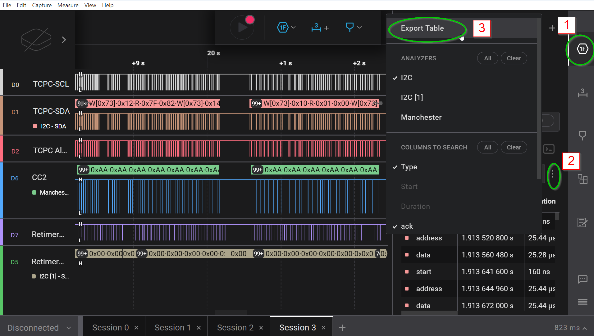
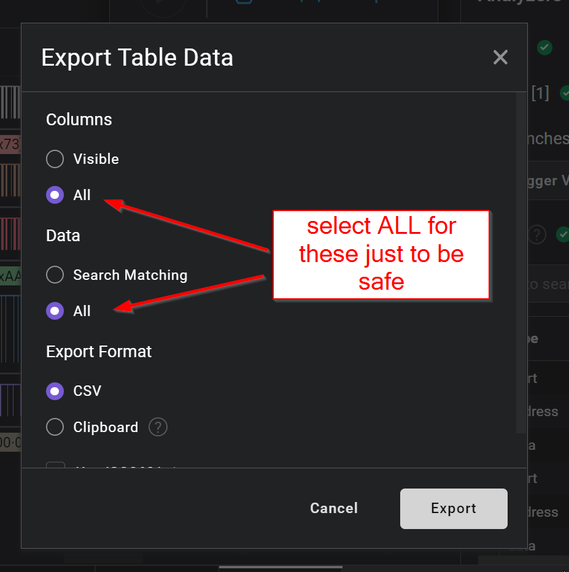

# Overview
This tool decodes the i2c exchange between EC(NPCX99nF) and TCPC(NCT3807_8).


# How to Run Decoder
1. export i2c captures from Saleae Logic 2 as shown below




2. Run the following command
```
python decode.py input_file.csv
```

3. Update reg_map.py and reg_fields.py if a given register is showing as just an address instead of name.